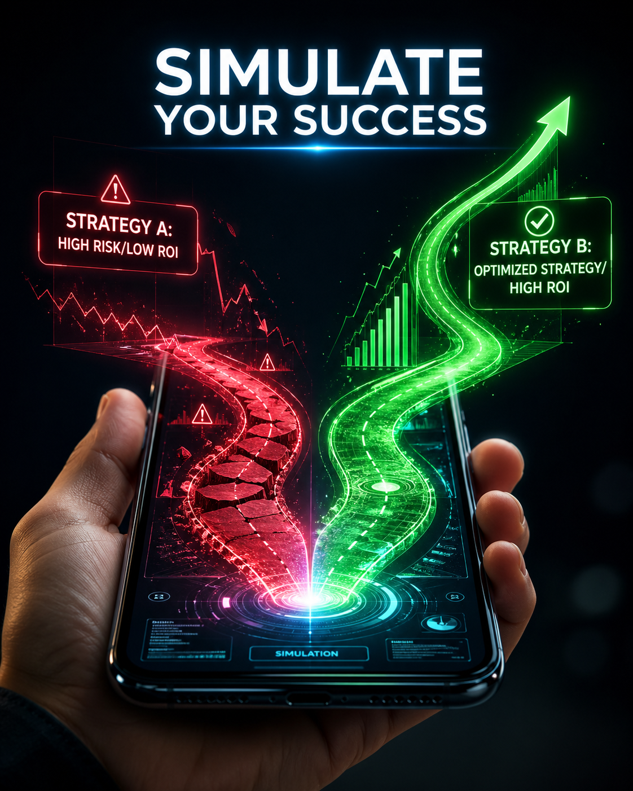
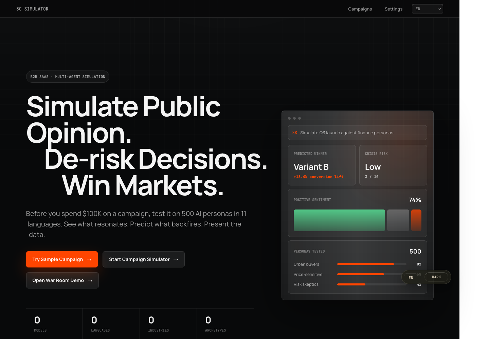
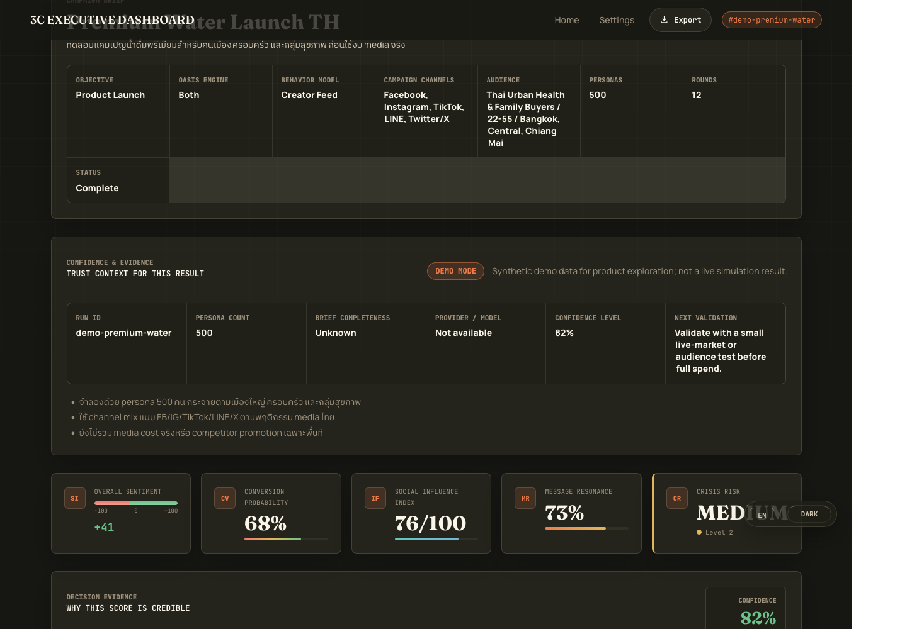
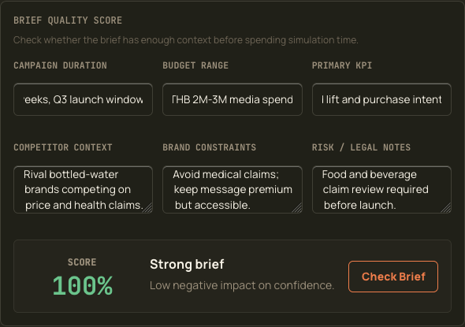
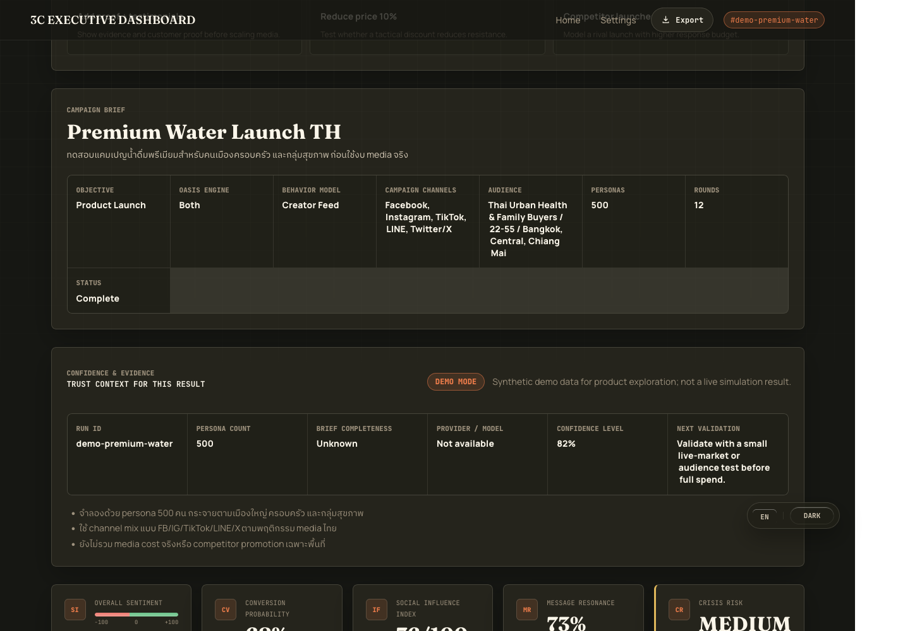
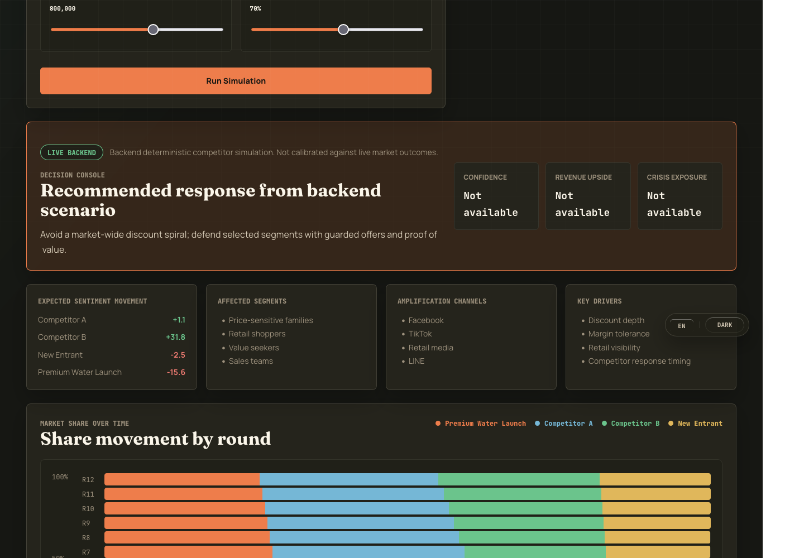
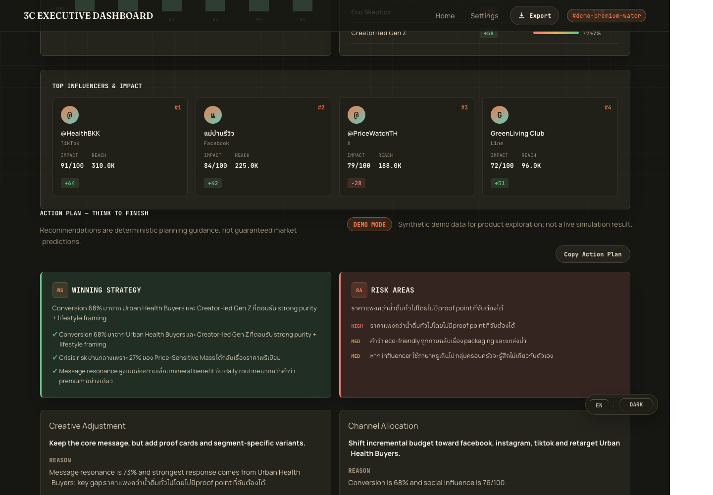
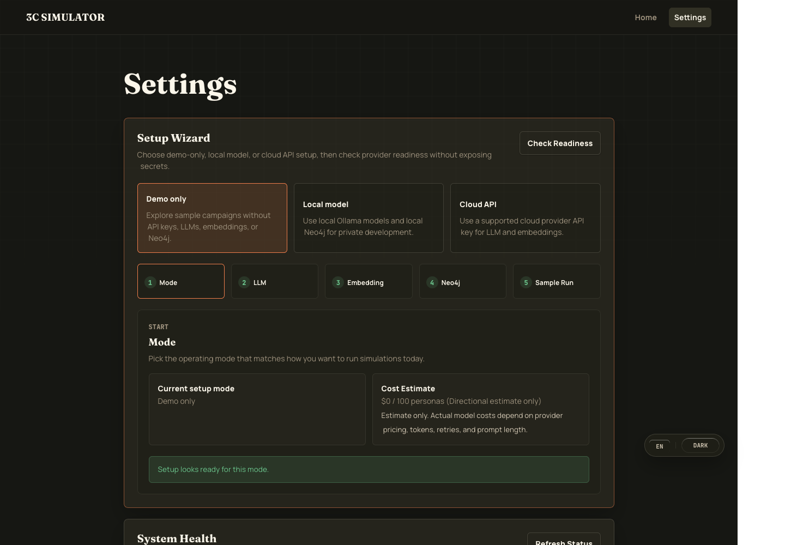

<div align="center">



# 3C Simulator

**Decision Intelligence Platform for Campaign, Competitor, and Crisis Simulation**

Simulate public opinion before spending real budget. Test campaign messages, competitor moves, and crisis scenarios against synthetic consumer personas, then turn the result into executive-ready evidence.

[](./LICENSE)
[](https://python.org)
[](https://vuejs.org)
[](https://github.com/camel-ai/oasis)

</div>

---

## What It Is

3C Simulator is a B2B SaaS-style platform for marketing managers, PR agencies, strategy teams, and crisis response teams.

It works like a **flight simulator for market decisions**:

1. Define a campaign, audience, channel mix, competitor move, or crisis scenario.
2. Generate culturally grounded synthetic personas.
3. Run multi-agent social simulation through OASIS-style behavior models.
4. Review KPIs, segment reactions, risk drivers, assumptions, and simulated quotes.
5. Export the evidence into a boardroom-ready slide deck or client-ready strategy pack.

This is not positioned as an AI playground. It is a decision-support system for answering:

- Which message should we launch?
- Which segment will resist?
- What risk could become a crisis?
- How should we revise the campaign before spending real media budget?
- What should we show leadership or a client?

For the current production/demo readiness matrix, see [docs/STATUS.md](docs/STATUS.md).
For demo, release validation, known limitations, and recommended next actions, see:

- [docs/DEMO_SCRIPT.md](docs/DEMO_SCRIPT.md)
- [docs/DEMO_DATA.md](docs/DEMO_DATA.md)
- [docs/FAQ.md](docs/FAQ.md)
- [docs/ANALYTICS.md](docs/ANALYTICS.md)
- [docs/SCREENSHOT_GUIDE.md](docs/SCREENSHOT_GUIDE.md)
- [docs/USER_JOURNEY.md](docs/USER_JOURNEY.md)
- [docs/RELEASE_NOTES.md](docs/RELEASE_NOTES.md)
- [docs/RELEASE_READINESS_CHECKLIST.md](docs/RELEASE_READINESS_CHECKLIST.md)
- [docs/SECURITY_REVIEW.md](docs/SECURITY_REVIEW.md)
- [docs/KNOWN_LIMITATIONS.md](docs/KNOWN_LIMITATIONS.md)
- [docs/POST_IMPLEMENTATION_ACTION_PLAN.md](docs/POST_IMPLEMENTATION_ACTION_PLAN.md)
- [docs/PILOT_PLAN.md](docs/PILOT_PLAN.md)
- [docs/ROADMAP.md](docs/ROADMAP.md)

---

## Try The Demo First

New users should be able to see value before configuring an LLM provider.

The product includes a public no-key demo flow:

- Demo campaign list: `GET /api/demo/campaigns`
- Demo dashboard: `GET /api/demo/campaigns/demo-premium-water/dashboard`
- Frontend sample route: `/dashboard/demo-premium-water`

The sample dashboard includes:

- campaign brief
- 7 executive KPIs
- confidence score
- assumptions
- why-this-score explanations
- risk drivers
- simulated persona quotes
- priority recommended actions

For local development:

```bash
cd frontend
npm install
npm run dev -- --host 127.0.0.1 --port 5174
```

Open:

```text
http://127.0.0.1:5174/dashboard/demo-premium-water
```

---

## Product Walkthrough

Screenshots below were reviewed after the PR T security-readiness pass and use the local demo flow with no auth token, API key, or real customer data. They show product workflow only; they do not claim public-pilot or production readiness.

### 1. Start From The Landing Page

The first screen positions 3C Simulator as a decision-intelligence product, not an AI playground.



### 2. Open The Demo Dashboard

The no-key demo shows source-labeled synthetic demo data, decision context, confidence/evidence, KPI cards, and recommended validation steps.



### 3. Check Brief Quality Before Simulation

Before spending simulation time, the Brief Quality Score checks objective, audience, market, budget, KPI, channels, competitor context, constraints, and risk/legal notes.



### 4. Review Simulation Evidence

The dashboard keeps result-source labeling visible and separates assumptions, confidence, KPI evidence, and next validation steps.



### 5. Stress-Test Competitive Scenarios

War Room defaults to backend deterministic simulation and labels the output as Live Backend. Local estimates are only shown as explicit fallback.



### 6. Turn Results Into Action

The Action Plan translates results into creative adjustment, channel allocation, crisis prevention, and validation guidance while preserving the result source.



### 7. Configure Demo, Local, Or Cloud Mode

The Settings Wizard checks readiness for demo-only, local model, and cloud API setups without exposing API keys or graph passwords.



For a presenter-friendly run-through, see [docs/DEMO_SCRIPT.md](docs/DEMO_SCRIPT.md). For safe sample briefs, see [docs/DEMO_DATA.md](docs/DEMO_DATA.md). For expected buyer and pilot-user questions, see [docs/FAQ.md](docs/FAQ.md). For a first-time user path, see [docs/USER_JOURNEY.md](docs/USER_JOURNEY.md).

---

## Core Product Pillars

### 1. Campaign Simulation

Create a campaign, define target audience, select campaign channels, and simulate likely public reaction.

Supported campaign objectives:

- message testing
- product launch
- brand perception
- competitor response
- crisis simulation

### 2. Competitor War Room

Model competitive dynamics across multiple brands. Simulate events such as price wars, first-mover launches, copycat moves, creator backlash, media blitzes, and scandals.

The War Room now works like a strategy sandbox:

- choose a live or demo campaign as the brand in play
- tune competitor budget and aggression
- select a response strategy such as proof-led defense, selective price match, creator counter-wave, or containment
- review market-share movement, risk exposure, response playbook, and immediate action recommendations

### 3. Crisis Intelligence

Stress-test sensitive narratives before they become real issues. Identify risk segments, likely objections, and message frames that reduce escalation.

---

## Key Features

### No-Key Demo Mode

Users can open a sample campaign and see a full executive dashboard without registering, creating an org, or entering an API key.

### Industry Templates

Start from industry-specific persona segments, crisis seeds, document seeds, and campaign defaults.

Deep built-in presets now include richer planner scaffolding: target segment archetypes, common objections, crisis triggers, typical KPIs, channel behavior, competitor archetypes, regulatory sensitivities, proof-point requirements, sample brief, risk checklist, action-plan hints, assumptions, and limitations.

Current built-in and importable template areas include:

- energy
- finance
- FMCG / CPG
- insurance / InsurTech
- retail / ecommerce
- real estate
- EV / automotive
- healthcare / wellness

Templates are assumptions for scenario planning, not market-truth or regulated advice. Replace sample budget, duration, KPI, competitor context, risk/legal notes, and channel mix with the user's actual campaign plan before running a simulation.

### Audience Channels

The user can describe where the audience actually lives, beyond the native simulation engine:

- Facebook
- Instagram
- TikTok
- YouTube
- LINE
- Twitter/X
- Reddit
- LinkedIn

### Budget Scenario Planner

Run assumption-based channel mix what-if planning before committing media spend. The planner accepts total budget, duration, target segments, channel mix, risk tolerance, and objective, then returns directional allocation ranges, trade-offs, confidence level, assumptions, limitations, and a recommended validation step.

This is not an exact ROI or ROAS predictor. It does not use live ad-platform cost data unless the user supplies approved planning inputs.

### OASIS Platform Presets

OASIS remains the core simulation engine. Platform presets translate modern channel intent into supported behavior models:

- auto
- microblog
- community forum
- group chat
- creator feed
- commerce intent

This keeps the backend compatible with the current OASIS runner while letting the product reflect real-world channel planning.

### Executive Dashboard

The dashboard is designed for business decisions, not only charts.

It includes:

- overall sentiment
- conversion probability
- social influence index
- message resonance
- crisis risk
- brand perception shift
- opinion polarization
- sentiment timeline
- segment breakdown
- simulated influence nodes
- action plan
- Thai executive summary

### Decision Evidence

Every score should be explainable.

The dashboard includes:

- confidence score
- assumptions
- persona sample evidence
- simulated quotes
- why-this-score explanations
- risk drivers
- recommended actions with priorities

Example insight:

```text
Crisis risk is medium because price-sensitive family personas reacted negatively
to premium pricing, while health-focused urban buyers remained strongly positive.
```

### Decision Engine

The dashboard now includes a deterministic strategy layer that converts KPIs into:

- recommended strategy
- next best action
- primary risk segment
- business impact
- estimated crisis loss
- projected market share shift
- KPI-to-business mapping

This layer is intentionally rule-based first, so recommendations are consistent, auditable, and easier to calibrate with real campaign outcomes.

### Strategy Sandbox

Run lightweight what-if analysis from dashboard KPIs:

- add proof points and testimonials
- reduce price by 10%
- simulate a competitor launch

The what-if engine returns KPI deltas, adjusted business impact, and an updated decision recommendation.

### Client-Ready Strategy Packs

For decision meetings, the backend can package existing dashboard/simulation payloads into two structured report modes:

- **Brand Executive Summary** for internal launch/revise/do-not-launch review.
- **Agency Client Pitch Summary** for agency-to-client strategy discussion.

Each pack includes executive decision summary, launch recommendation, KPI summary, segment reactions, risk drivers, crisis watchouts, recommended action plan, and next validation steps. Every section inherits source/provenance metadata such as `source_mode`, `data_basis`, confidence level, assumptions, limitations, and recommended validation step.

### Revised Brief v2

Dashboard Action Plans can be turned into a reviewable revised brief before the next simulation or creative review. The revised brief includes objective, target segments, key message, tone and voice, proof points, channel recommendations, risk guardrails, validation plan, and creative team notes.

The brief keeps provenance from the source action plan and is deterministic planning guidance, not a guarantee of improved market outcomes.

### Backend-First Comparator

The A/B/C Comparator compares 2-5 campaign directions through the backend first. It includes backend demo fixtures for:

- Emotional / storytelling direction.
- Proof-led / trust direction.
- Price / promotion direction.

Comparator output includes ranked recommendation, metric wins, segment strengths and weaknesses, conversion and engagement estimates, crisis/risk comparison, trade-offs, recommended use case, and source/provenance metadata per variant and for the overall comparison. Browser-side output is available only as an explicit Local Estimate fallback.

### Export To Slide

Export simulation output into client- or leadership-ready files:

- PowerPoint `.pptx`
- CSV `.csv`
- browser-side quick download fallback

Recommended deck structure:

1. Executive Summary
2. KPI Dashboard
3. Segment Insight
4. Risk & Crisis Drivers
5. Recommended Action Plan

### System Health

Settings includes a system health view backed by `GET /api/status`.

### Settings Wizard

Settings includes a setup wizard for three supported modes:

- **Demo only**: no LLM, embedding provider, or Neo4j connection required.
- **Local model**: configuration readiness for local Ollama-style LLM/embedding and local Neo4j.
- **Cloud API**: configuration readiness for supported cloud LLM/embedding providers and Neo4j Aura-style graph storage.

The readiness endpoint (`POST /api/settings/readiness`) is deterministic and does not make live provider calls. It validates required fields using secret-presence flags, so API keys and passwords are not echoed back to the browser. The optional LLM live test remains an authenticated runtime check and depends on real provider availability.

### Result Source Labels

The UI labels simulation and decision outputs with one of the supported result-source modes:

- **Demo Mode**: deterministic sample data intended for onboarding and product exploration.
- **Local Estimate**: browser-side deterministic fallback, visibly warned and not presented as live backend output.
- **Live Backend**: backend-generated deterministic output.
- **Backend Verified**: backend route completed successfully and supplied the displayed result.
- **Unknown Source**: source metadata was unavailable and should be treated conservatively.

It checks:

- backend API readiness
- Neo4j availability
- LLM provider configuration
- embedding provider configuration
- runtime storage
- default model
- rough cost estimate per 100 personas

---

## Workflow

```text
1. Pick template or demo campaign
   Choose an industry template, import a template, or open sample data.

2. Define campaign brief
   Name, objective, target segment, regions, persona count, channels, and risk concerns.

3. Select behavior model
   Choose campaign channels and OASIS behavior preset.

4. Run simulation
   Personas react, post, debate, and shift sentiment across simulated rounds.

5. Review decision evidence
   Read KPIs, segment drivers, assumptions, persona quotes, and recommended actions.

6. Export
   Generate boardroom-ready slides or CSV evidence.
```

---

## Quick Start

### Prerequisites

- Python 3.11+
- Node.js 20+
- Docker and Docker Compose
- Neo4j 5.18 if running graph features locally
- Optional: Ollama for local LLM / embedding

### Frontend

```bash
cd frontend
npm install
npm run dev -- --host 127.0.0.1 --port 5174
```

### Backend

```bash
cd backend
python3 -m venv .venv
source .venv/bin/activate
pip install -e ".[dev]"
python run.py
```

By default the backend reads configuration from environment variables and `.env`.

### Docker Dev Stack

```bash
cp .env.example .env
docker compose -f docker-compose.dev.yml up -d --build
```

### Local Ollama Mode

```bash
docker compose --profile local up -d
docker exec 3c-ollama ollama pull qwen2.5:7b
docker exec 3c-ollama ollama pull nomic-embed-text
```

---

## Runtime Configuration

Example `.env`:

```bash
LLM_PROVIDER=deepseek
LLM_API_KEY=replace-with-provider-api-key
LLM_MODEL_NAME=deepseek-chat

EMBEDDING_PROVIDER=openai
EMBEDDING_API_KEY=replace-with-embedding-api-key

NEO4J_URI=bolt://localhost:7687
NEO4J_USER=neo4j
NEO4J_PASSWORD=replace-with-neo4j-password
```

The Settings page can manage runtime provider values, per-task model overrides, language, and system health.

---

## API Reference

All product APIs are registered under `/api/*`.

### Public APIs

| Method | Endpoint | Description |
|---|---|---|
| GET | `/health` | Basic backend liveness |
| GET | `/api/status` | System health and readiness |
| GET | `/api/demo/campaigns` | No-key demo campaign list |
| GET | `/api/demo/campaigns/{id}/dashboard` | No-key demo dashboard |
| GET | `/api/industry/templates` | Public industry template list |
| POST | `/api/brief/quality` | Deterministic brief completeness scoring |
| POST | `/api/brief/revise` | Deterministic Revised Brief v2 from an Action Plan |
| POST | `/api/decision/budget-scenario` | Deterministic budget/channel scenario planner |
| GET | `/api/settings/providers` | Safe provider catalog |
| POST | `/api/settings/readiness` | Secret-safe setup readiness check |

### Auth

| Method | Endpoint | Description |
|---|---|---|
| POST | `/api/auth/register` | Create organization and admin user |
| POST | `/api/auth/login` | Login and receive JWT |
| GET | `/api/auth/me` | Current user profile |
| POST | `/api/auth/api-key` | Generate API key |

### Campaigns

| Method | Endpoint | Description |
|---|---|---|
| POST | `/api/campaign` | Create campaign |
| GET | `/api/campaign` | List organization campaigns |
| GET | `/api/campaign/{id}` | Campaign details |
| PUT | `/api/campaign/{id}` | Update campaign |
| DELETE | `/api/campaign/{id}` | Delete campaign |
| POST | `/api/campaign/{id}/pipeline/start` | Start campaign pipeline |
| GET | `/api/campaign/{id}/pipeline/status` | Pipeline progress |

### Dashboard

| Method | Endpoint | Description |
|---|---|---|
| GET | `/api/dashboard/campaign/{id}/kpi` | Executive KPIs |
| GET | `/api/dashboard/campaign/{id}/report` | Full executive report |
| GET | `/api/dashboard/campaign/{id}/timeline` | Sentiment timeline |
| GET | `/api/dashboard/campaign/{id}/segments` | Segment breakdown |

### Industry Templates

| Method | Endpoint | Description |
|---|---|---|
| GET | `/api/industry/templates` | List templates |
| POST | `/api/industry/templates/import` | Import template JSON |
| POST | `/api/industry/templates/validate` | Validate template JSON |
| DELETE | `/api/industry/templates/{id}` | Delete uploaded template |
| GET | `/api/industry/templates/{id}/preset` | Campaign preset from template |
| GET | `/api/industry/templates/{id}/personas` | Template persona segments |
| GET | `/api/industry/templates/{id}/crises` | Template crisis scenarios |
| GET | `/api/industry/templates/{id}/seeds` | Template document seeds |

### Simulation

| Method | Endpoint | Description |
|---|---|---|
| POST | `/api/simulation/create` | Create simulation instance |
| POST | `/api/simulation/prepare` | Prepare simulation assets |
| POST | `/api/simulation/start` | Start simulation runner |
| POST | `/api/simulation/stop` | Stop simulation runner |
| GET | `/api/simulation/{id}/run-status` | Runtime status |
| GET | `/api/simulation/{id}/run-status/detail` | Detailed runtime status |

### Comparator, Impact, Competitor, Export

| Method | Endpoint | Description |
|---|---|---|
| POST | `/api/decision/analyze` | Convert KPIs into recommendation, risk, actions, and business impact |
| POST | `/api/decision/what-if` | Run deterministic what-if strategy simulation |
| POST | `/api/comparator/compare` | Compare 2-5 campaigns |
| GET | `/api/comparator/metrics` | Comparator metric definitions |
| GET | `/api/comparator/demo/campaigns` | Public backend demo comparator variants |
| POST | `/api/comparator/demo/compare` | Compare backend demo comparator variants |
| POST | `/api/impact/calculate` | Business impact calculation |
| GET | `/api/impact/scenarios/{sentiment}` | Quick impact scenario |
| GET | `/api/competitor/scenarios` | War room scenario list |
| POST | `/api/competitor/simulate` | Run competitor simulation |
| POST | `/api/export/pptx` | Export PowerPoint deck |
| POST | `/api/export/csv` | Export CSV data |
| POST | `/api/export/strategy-pack` | Build a client-ready Brand or Agency strategy pack payload |

---

## Architecture

```text
Vue 3 Frontend
  Home
  Campaigns
  Dashboard
  Comparator
  Impact Simulator
  War Room
  Settings / System Health
        |
        | JWT / API key / public demo APIs
        v
Flask Backend
  Auth + Tenant Middleware
  Campaign API
  Persona Factory
  Industry Templates
  KPI Calculator
  Decision Engine
  Demo API
  Status API
  Export Engine
  OASIS Simulation Runner
        |
        v
Neo4j + JSON tenant storage + LLM providers
```

Key decisions:

- **Tenant scoped by default**: authenticated APIs resolve `org_id` through middleware.
- **Public demo path**: `/api/demo/*` lets users see value before setup.
- **OASIS-native runner**: Twitter/X and Reddit remain the execution backend, with product-level channel presets layered on top.
- **JSON templates**: industry templates are importable and versionable.
- **Runtime provider switching**: 17 LLM providers and multiple embedding providers are available through a unified configuration layer.
- **Decision evidence over black-box scores**: dashboard output includes assumptions and explanation panels.
- **Deterministic decision layer**: strategy recommendations and what-if deltas are rule-based first, not hidden in an LLM prompt.

---

## Technology Stack

| Layer | Technology |
|---|---|
| Frontend | Vue 3, Vite, Vue Router, vue-i18n |
| Backend | Flask, Pydantic, Python 3.11 |
| Simulation | OASIS / CAMEL-AI |
| Graph | Neo4j 5.18 |
| LLM | Ollama, OpenAI, Anthropic, Google, DeepSeek, Groq, OpenRouter, xAI, Mistral, Together AI, GLM, MiniMax, Kimi, DashScope, Hugging Face, Bedrock, Vercel |
| Embeddings | Ollama, OpenAI, Google, Cohere |
| Export | python-pptx, CSV |
| Auth | JWT and API keys |
| Storage | Tenant-scoped JSON files plus Neo4j graph storage |

---

## Testing

Backend contract tests:

```bash
./backend/.venv/bin/python -m pytest backend/tests
```

Frontend production build:

```bash
cd frontend
npm run build
```

Locale validation:

```bash
for f in frontend/src/locales/*.json; do python3 -m json.tool "$f" >/dev/null || exit 1; done
```

Available frontend scripts:

```bash
cd frontend
npm run build
```

There is no frontend unit-test or lint script configured in `frontend/package.json` yet.

---

## Product Roadmap

See [docs/ROADMAP.md](docs/ROADMAP.md). The highest-priority next work is calibration against real campaign outcomes, broader QA automation, deployment hardening, and pilot-user feedback loops.

---

## Credits

Built on and inspired by:

- [MiroFish](https://github.com/666ghj/MiroFish) by 666ghj / Shanda Group
- [OASIS](https://github.com/camel-ai/oasis) by CAMEL-AI
- [MiroFish-Offline](https://github.com/nikmcfly/MiroFish-Offline) by nikmcfly

3C Simulator / MarketingSimulation extensions by [chawit1103](https://github.com/chawit1103):

- multi-tenant SaaS foundation
- campaign pipeline orchestration
- 11-country persona factory
- industry template system
- executive KPI dashboard
- decision evidence panel
- no-key demo onboarding
- export-to-slide workflow
- 11-language UI

---

## License

AGPL-3.0. See [LICENSE](./LICENSE).
